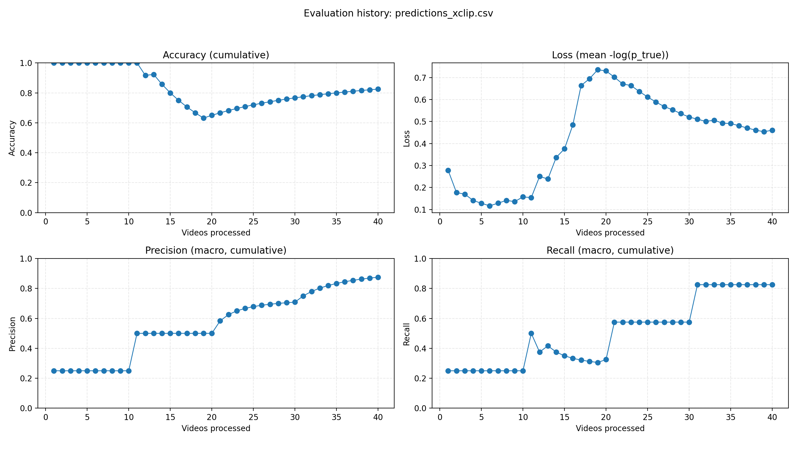
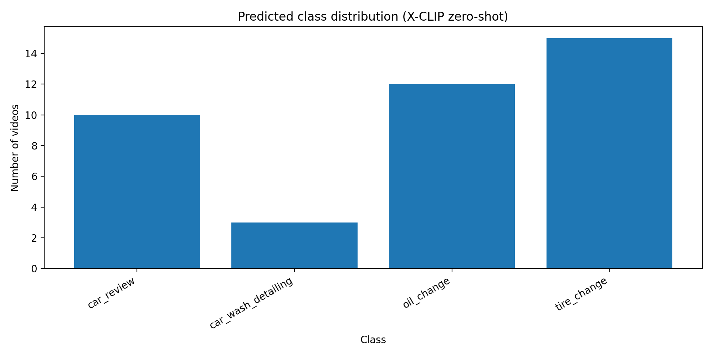
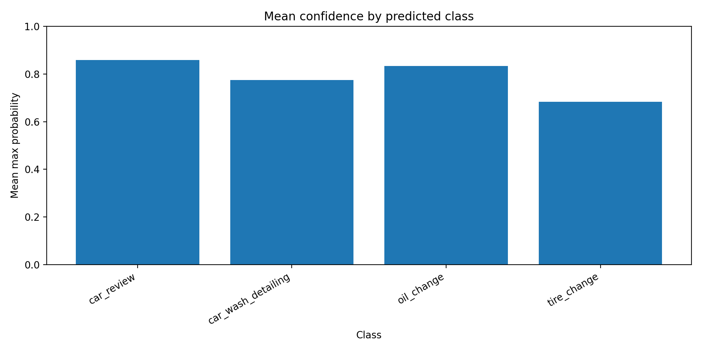

# Zero-Shot Video Classification (X-CLIP) — Car Services Dataset


---

## Аннотация
В работе реализована система классификации видеороликов по 4 классам автомобильного сервиса с использованием предобученной модели **X-CLIP** без дообучения на собственном датасете (режим **zero-shot**). Классы задаются набором текстовых подсказок (**prompts**), после чего модель сравнивает “видео ↔ текст” и выдаёт вероятности `p_<class>` и метку `pred`. Для оценки качества выполняется сравнение `label` и `pred`, рассчитываются метрики (Accuracy, Precision/Recall/F1 macro), строятся PNG‑графики (distribution/confidence + history‑график метрик).

---

## Содержание
1. [Постановка задачи и цель работы](#1-постановка-задачи-и-цель-работы)
2. [Теоретическая база](#2-теоретическая-база)
3. [Данные и структура датасета](#3-данные-и-структура-датасета)
4. [Архитектура и модули проекта](#4-архитектура-и-модули-проекта)
5. [Алгоритм работы системы](#5-алгоритм-работы-системы)
6. [Экспериментальная установка и воспроизводимость](#6-экспериментальная-установка-и-воспроизводимость)
7. [Результаты и оценка качества](#7-результаты-и-оценка-качества)
8. [Обсуждение, ограничения и улучшения](#8-обсуждение-ограничения-и-улучшения)
9. [Файлы проекта (ссылки)](#9-файлы-проекта-ссылки)
10. [Использованные источники](#10-использованные-источники)

---

## 1. Постановка задачи и цель работы

**Цель работы:** реализовать систему классификации видеороликов по **4 классам** без дообучения (**zero-shot**) с использованием модели **X-CLIP** и текстовых подсказок (**prompts**).

**Классы (4):**
- `car_review`
- `car_wash_detailing`
- `oil_change`
- `tire_change`

**Идея zero-shot:** модель получает **видео** + набор **текстовых описаний классов**, вычисляет похожесть (logits), переводит её в вероятности и выбирает класс с максимальным значением.

**Выходные артефакты системы:**
- `manifest.csv` — список видео с истинными метками (`label`) по структуре папок
- `predictions_xclip.csv` — результаты предсказаний + вероятности `p_<class>`
- `metrics_xclip.json` — итоговые метрики качества (и матрица ошибок)
- PNG‑графики:
  - distribution (распределение предсказанных классов)
  - confidence (средняя уверенность по предсказанным классам)
  - history (Accuracy/Loss/Precision/Recall по мере обработки видео)

---

## 2. Теоретическая база

### 2.1 CLIP / X-CLIP и принцип “видео ↔ текст”
Модели семейства CLIP обучаются так, чтобы **текстовые описания** и **визуальные данные** (изображения/видео) отображались в общее пространство признаков.  
**X-CLIP** расширяет идею на видео: вместо одного изображения анализируется последовательность кадров (**frames**), что позволяет учитывать временную структуру (движение, смену сцен).

### 2.2 Zero-shot классификация и роль prompts
В zero-shot классификации классы не задаются обучением, а описываются текстом. Для каждого класса формируется набор **prompts** (несколько фраз), например:
- «замена масла», «слив отработанного масла», «oil change service» и т.п.

Использование **нескольких prompts** на класс уменьшает зависимость от одной формулировки и обычно повышает стабильность результата.

### 2.3 Как получается `p_<class>` и `pred`
Для каждого prompt модель возвращает оценку похожести (**logit**). Далее:
1. logits усредняются внутри каждого класса (по его prompts)
2. применяется `softmax` по классам → вероятности `p_<class>`
3. выбирается `pred = argmax(p)`

**Важно:** это не “истинная вероятность” в статистическом смысле, а нормированная оценка уверенности модели относительно заданных классов и prompts.

### 2.4 Метрики качества классификации
Используются стандартные метрики:
- **Accuracy:** доля правильных предсказаний  
- **Precision (macro):** средняя точность по классам (не зависит от дисбаланса)  
- **Recall (macro):** средняя полнота по классам  
- **F1 (macro):** гармоническое среднее precision и recall (по классам)

Использование **macro‑средних** важно при возможном дисбалансе классов, т.к. каждый класс влияет одинаково.

---

## 3. Данные и структура датасета

### 3.1 Организация датасета по папкам
Датасет хранится в виде папок, где имя папки соответствует `label`:

```text
data/Dataset/Videos/
  car_review/
  car_wash_detailing/
  oil_change/
  tire_change/
```

**Преимущество:** истинная метка (`label`) автоматически извлекается из пути к файлу.

### 3.2 Число примеров по классам (support)
Ниже приведено количество видео по каждому классу (из `classification_report`):

| Класс | Support | Precision | Recall | F1-score |
| --- | ---: | ---: | ---: | ---: |
| `car_review` | 10 | 1.000 | 1.000 | 1.000 |
| `car_wash_detailing` | 10 | 1.000 | 0.300 | 0.462 |
| `oil_change` | 10 | 0.833 | 1.000 | 0.909 |
| `tire_change` | 10 | 0.667 | 1.000 | 0.800 |

---

## 4. Архитектура и модули проекта

### 4.1 Общая структура (логика)
Проект реализован как последовательность шагов:
1) **Build manifest** → создаём `manifest.csv`  
2) **Predict** → получаем `predictions_xclip.csv` + PNG сводки  
3) **Evaluate** → считаем метрики и строим PNG “history”

### 4.2 Роли модулей (что за что отвечает)
Типичная структура модулей:
- `main.py` — меню/точка входа (выбор шагов)
- `make_manifest.py` — сканирование папок и создание `manifest.csv`
- `predict_zero_shot.py` — zero-shot предсказание X-CLIP, формирование `predictions_xclip.csv`, построение PNG‑сводок
- `video_io.py` — чтение видео и выборка кадров (decord/OpenCV)
- `xclip_backend.py` — загрузка модели/processor, выбор устройства (CPU/GPU)
- `prompts.py` — словарь `PROMPTS_BY_CLASS`
- `evaluate_zero_shot.py` — расчёт метрик и построение `evaluation_history_xclip.png`
- `utils.py` — вспомогательные функции (создание папок, безопасные пути и т.д.)

---

## 5. Алгоритм работы системы

### 5.1 Шаг 1 — Build manifest
**Вход:** папка `data/Dataset/Videos/`  
**Выход:** `data/Dataset/manifest.csv`

**Содержимое manifest:**
- `path` — путь к видео
- `label` — истинный класс

### 5.2 Шаг 2 — Predict (X-CLIP zero-shot)
**Вход:** `manifest.csv`  
**Выход:** `CSV/predictions_xclip.csv` + PNG (`predictions_summary*.png`)

**Ключевые этапы:**
1. загрузка модели `microsoft/xclip-base-patch32`
2. выбор `num_frames` кадров равномерно по длительности ролика
3. подготовка `pixel_values` для модели (тензор видео)
4. расчёт `p_<class>` (по prompts)
5. запись результатов в CSV

**Формат `predictions_xclip.csv`:**
- `path`, `label`, `pred`
- `p_<class>` для каждого класса  
- при ошибках чтения/обработки: `pred="__ERROR__"`, `error=<stacktrace>`

**PNG‑сводки:**
- `CSV/predictions_summary.png` — сколько видео отнесено к каждому классу  
- `CSV/predictions_summary_confidence.png` — средняя уверенность модели по классам (max probability)

### 5.3 Шаг 3 — Evaluate (метрики + history PNG)
**Вход:** `CSV/predictions_xclip.csv`  
**Выход:** `CSV/metrics_xclip.json` + `PNG/evaluation_history_xclip.png`

**Что делает evaluation:**
- сравнивает `label` и `pred`
- рассчитывает метрики (Accuracy, Precision/Recall/F1 macro)
- строит **history‑график** (кумулятивно)

**Как устроен history‑график:**
- по оси X: **количество обработанных видео**
- Accuracy/Precision/Recall: пересчитываются на накопленном наборе
- Loss: среднее `-log(p_true)` (если в CSV присутствуют `p_<class>`), иначе может быть `NaN`

---

## 6. Экспериментальная установка и воспроизводимость

### 6.1 Требования
- Python 3.10+ (рекомендуется)
- `torch`, `transformers`, `numpy`, `pandas`, `tqdm`, `scikit-learn`, `matplotlib`
- чтение видео: `decord` или `opencv-python`

### 6.2 Запуск (типовой сценарий)
1) Сформировать manifest:
```bash
python main.py
# выбрать пункт 1
```

2) Сделать предсказания:
```bash
python main.py
# выбрать пункт 2
```

3) Выполнить оценку:
```bash
python main.py
# выбрать пункт 3
```

### 6.3 Как смотреть отчёт в VS Code
Открой `.md` и нажми:
- `Ctrl + Shift + V` (Preview)
- `Ctrl + K`, затем `V` (Preview справа)

---

## 7. Результаты и оценка качества

### 7.1 Итоговые метрики
| Метрика | Значение |
| --- | ---: |
| Accuracy | 0.825 |
| Precision (macro) | 0.875 |
| Recall (macro) | 0.825 |
| F1 (macro) | 0.7927 |
| Кол-во видео (без ошибок) | 40 |
| Ошибок пропущено (`__ERROR__`) | 0 |

### 7.2 Графики (PNG)

> Чтобы картинки отображались, файл отчёта должен лежать рядом с папками `PNG/` и `CSV/`.

#### 7.2.1 Evaluation history (как training history, но по видео)


#### 7.2.2 Распределение предсказанных классов


#### 7.2.3 Средняя уверенность по предсказанным классам


### 7.3 Матрица ошибок (confusion matrix)
| True \ Pred | car_review | car_wash_detailing | oil_change | tire_change |
| --- | ---: | ---: | ---: | ---: |
| `car_review` | 10 | 0 | 0 | 0 |
| `car_wash_detailing` | 0 | 3 | 2 | 5 |
| `oil_change` | 0 | 0 | 10 | 0 |
| `tire_change` | 0 | 0 | 0 | 10 |

### 7.4 Краткий анализ
- Для класса `car_wash_detailing` наблюдаются ошибки (путаница): `tire_change`: 5, `oil_change`: 2.
- Верно распознано `car_wash_detailing`: 3 из 10 (recall по классу = 0.30).
- Классы с идеальными метриками (precision=1.0 и recall=1.0): `car_review`.

---

## 8. Обсуждение, ограничения и улучшения

### 8.1 Почему возникают ошибки (особенно `car_wash_detailing`)
Возможные причины:
- **Семантическое пересечение классов:** визуально “детейлинг/мойка” может содержать действия, похожие на “обслуживание” (инструменты, помещение, автомобиль на сервисе).
- **Короткие ролики / мало информативных кадров:** при `num_frames=8` важные кадры могут не попасть в выборку.
- **Слабые prompts:** если prompts недостаточно точны или слишком общие, модель смешивает смысл.

### 8.2 Практические улучшения (без обучения)
1) **Prompt engineering**
   - добавить 5–10 дополнительных prompts для `car_wash_detailing`
   - использовать более “узкие” слова: *foam, rinse, wax, polishing, interior vacuum, pressure washer*
2) **Увеличить число кадров**
   - `num_frames = 16` или 24
   - альтернативно: выборка кадров по сценам (если реализовать детектор смены сцен)
3) **Фильтрация/калибровка по уверенности**
   - если `max(p) < threshold`, помечать как “uncertain” (не уверен)
4) **Смена модели**
   - попробовать другую версию X‑CLIP или аналогичную video-text модель
5) **Переход к few-shot / fine-tuning**
   - если появится возможность размечать данные и обучать модель/голову на домене

### 8.3 Угрозы валидности
- небольшой размер датасета → метрики могут быть нестабильны
- классы могут быть неравномерны по сложности/разнообразию
- zero-shot сильно зависит от качества prompts и доменного совпадения обучающих данных модели

---

## 9. Файлы проекта (ссылки)

- Manifest: [`data/Dataset/manifest.csv`](data/Dataset/manifest.csv)
- Предсказания: [`CSV/predictions_xclip.csv`](CSV/predictions_xclip.csv)
- Метрики (JSON): [`CSV/metrics_xclip.json`](CSV/metrics_xclip.json)
- График history: [`PNG/evaluation_history_xclip.png`](PNG/evaluation_history_xclip.png)
- Графики предсказаний:
  - [`CSV/predictions_summary.png`](CSV/predictions_summary.png)
  - [`CSV/predictions_summary_confidence.png`](CSV/predictions_summary_confidence.png)

---

## 10. Использованные источники
1. CLIP (Contrastive Language–Image Pretraining) — идея совместного пространства “текст-изображение”.
2. X-CLIP — расширение CLIP-подхода на видео.
3. HuggingFace Transformers — загрузка моделей и обработчиков (processor).
4. scikit-learn — метрики classification (accuracy/precision/recall/f1, confusion matrix).
5. OpenCV / decord — чтение видео и выбор кадров.
